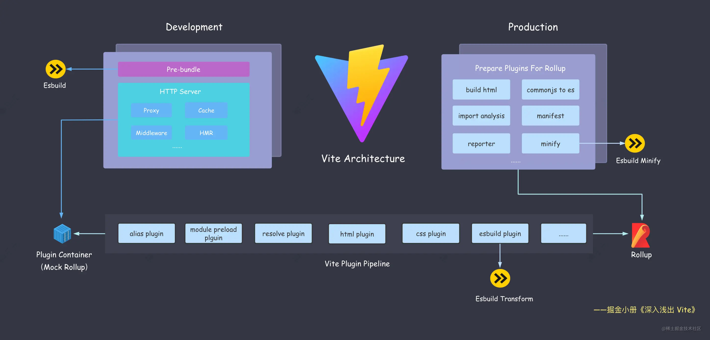
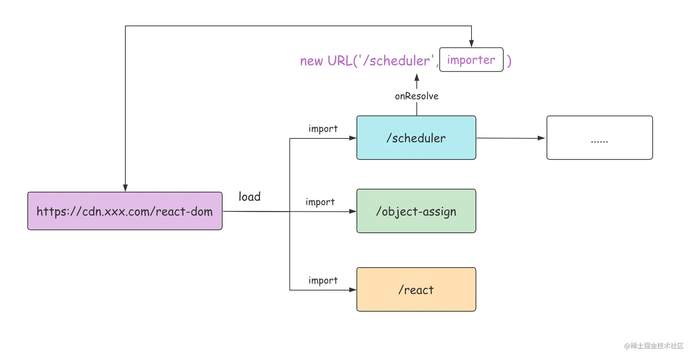
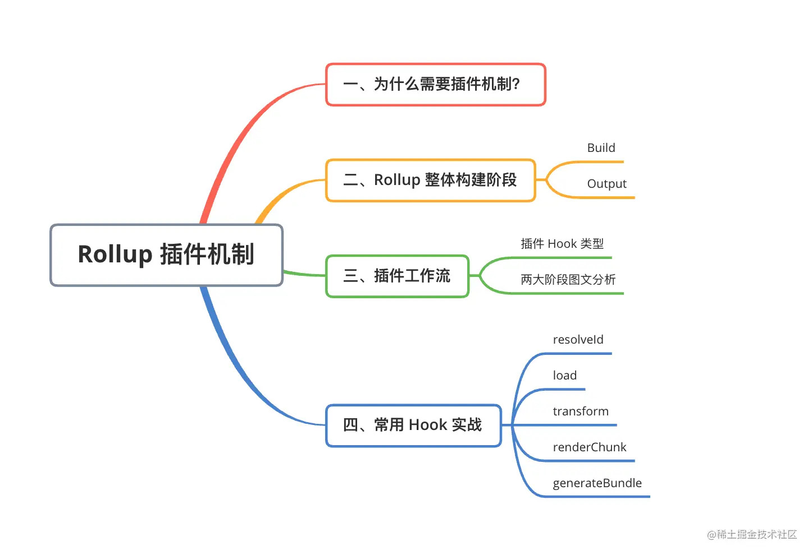
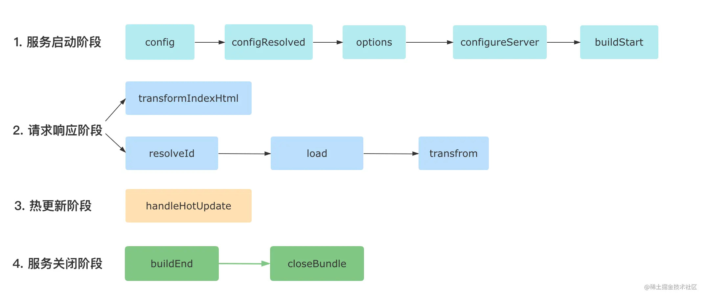
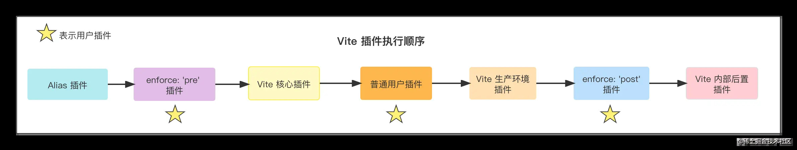

- [Vite\_demo](#vite_demo)
  - [Esbuild@0.14.18](#esbuild01418)
    - [Esbuild-demo-01: Code Call(source)](#esbuild-demo-01-code-callsource)
    - [Esbuild-demo-02: CDN depends on pull plugin(source)](#esbuild-demo-02-cdn-depends-on-pull-pluginsource)
    - [Esbuild-demo-03: Implement HTML build plugin(source)](#esbuild-demo-03-implement-html-build-pluginsource)
  - [Rollup](#rollup)
    - [Rollup-demo-01: Basic configuration(source)](#rollup-demo-01-basic-configurationsource)
  - [Vite plugin development (source)](#vite-plugin-development-source)
    - [Test hooks (source)](#test-hooks-source)
    - [Virtual module loading (source)](#virtual-module-loading-source)
    - [Svg component form loading (source)](#svg-component-form-loading-source)
- [Reference](#reference)

# Vite_demo



## Esbuild@0.14.18

### Esbuild-demo-01: Code Call([source](https://github.com/Jinx-FX/vite-demos/tree/main/esbuild_demo_01))

**代码调用**

Esbuild 对外暴露了一系列的 API，主要包括两类: Build API和Transform API，我们可以在 Nodejs 代码中通过调用这些 API 来使用 Esbuild 的各种功能。

- 项目打包——Build API 
  - Build API主要用来进行项目打包，包括 `build` `、buildSync` 和 `serve` 三个方法。
- 单文件转译——Transform API
  - 与 Build API 类似，它也包含了同步和异步的两个方法，分别是   `transformSync` 和 `transform` 

### Esbuild-demo-02: CDN depends on pull plugin([source](https://github.com/Jinx-FX/vite-demos/tree/main/esbuild_demo_01))

**CDN 依赖拉取插件**

Esbuild 原生不支持通过 HTTP 从 CDN 服务上拉取对应的第三方依赖资源，如下代码所示:

```js
// src/index.jsx
// react-dom 的内容全部从 CDN 拉取
// 这段代码目前是无法运行的
import { render } from "https://cdn.skypack.dev/react-dom";
import React from 'https://cdn.skypack.dev/react'

let Greet = () => <h1>Hello, juejin!</h1>;

render(<Greet />, document.getElementById("root"));
```

现在通过 Esbuild 插件来识别这样的 url 路径，然后从网络获取模块内容并让 Esbuild 进行加载，甚至不再需要npm install安装依赖了.

先从最简单的版本开始写起:

```js
// http-import-plugin.js
module.exports = () => ({
  name: "esbuild:http",
  setup(build) {
    let https = require("https");
    let http = require("http");

    // 1. 拦截 CDN 请求
    build.onResolve({ filter: /^https?:\/\// }, (args) => ({
      path: args.path,
      namespace: "http-url",
    }));

    // 2. 通过 fetch 请求加载 CDN 资源
    build.onLoad({ filter: /.*/, namespace: "http-url" }, async (args) => {
      let contents = await new Promise((resolve, reject) => {
        function fetch(url) {
          console.log(`Downloading: ${url}`);
          let lib = url.startsWith("https") ? https : http;
          let req = lib
            .get(url, (res) => {
              if ([301, 302, 307].includes(res.statusCode)) {
                // 重定向
                fetch(new URL(res.headers.location, url).toString());
                req.abort();
              } else if (res.statusCode === 200) {
                // 响应成功
                let chunks = [];
                res.on("data", (chunk) => chunks.push(chunk));
                res.on("end", () => resolve(Buffer.concat(chunks)));
              } else {
                reject(
                  new Error(`GET ${url} failed: status ${res.statusCode}`)
                );
              }
            })
            .on("error", reject);
        }
        fetch(args.path);
      });
      return { contents };
    });
  },
});
```

然后新建build.js文件，内容如下:

```js
const { build } = require("esbuild");
const httpImport = require("./http-import-plugin");
async function runBuild() {
  build({
    absWorkingDir: process.cwd(),
    entryPoints: ["./src/index.jsx"],
    outdir: "dist",
    bundle: true,
    format: "esm",
    splitting: true,
    sourcemap: true,
    metafile: true,
    plugins: [httpImport()],
  }).then(() => {
    console.log("🚀 Build Finished!");
  });
}

runBuild();
```

除了要解析 react-dom 这种直接依赖的路径，还要解析它依赖的路径，也就是间接依赖的路径。

那如何来实现这个效果呢？不妨加入这样一段 `onResolve` 钩子逻辑:

```js
// 拦截间接依赖的路径，并重写路径
// tip: 间接依赖同样会被自动带上 `http-url`的 namespace
build.onResolve({ filter: /.*/, namespace: "http-url" }, > (args) => ({
  // 重写路径
  path: new URL(args.path, args.importer).toString(),
  namespace: "http-url",
}));
```

加了这段逻辑后，Esbuild 路径解析的流程如下:



### Esbuild-demo-03: Implement HTML build plugin([source](https://github.com/Jinx-FX/vite-demos/tree/main/esbuild_demo_01))

**实现 HTML 构建插件**

Esbuild 作为一个前端打包工具，本身并不具备 HTML 的构建能力。也就是说，当它把 js/css 产物打包出来的时候，并不意味着前端的项目可以直接运行了，我们还需要一份对应的入口 HTML 文件。而这份 HTML 文件当然可以手写一个，但手写显得比较麻烦，尤其是产物名称带哈希值的时候，每次打包完都要替换路径。那么，我们能不能通过 Esbuild 插件的方式来自动化地生成 HTML 呢？

从 `outputs` 属性中我们可以看到产物的路径，这意味着我们可以在插件中拿到所有 js 和 css 产物，然后自己组装、生成一个 HTML，实现自动化生成 HTML 的效果。

接着来实现一下这个插件的逻辑，首先新建 `html-plugin.js`，内容如下:

```js
const fs = require("fs/promises");
const path = require("path");
const { createScript, createLink, generateHTML } = require('./util');

module.exports = () => {
  return {
    name: "esbuild:html",
    setup(build) {
      build.onEnd(async (buildResult) => {
        if (buildResult.errors.length) {
          return;
        }
        const { metafile } = buildResult;
        // 1. 拿到 metafile 后获取所有的 js 和 css 产物路径
        const scripts = [];
        const links = [];
        if (metafile) {
          const { outputs } = metafile;
          const assets = Object.keys(outputs);

          assets.forEach((asset) => {
            if (asset.endsWith(".js")) {
              scripts.push(createScript(asset));
            } else if (asset.endsWith(".css")) {
              links.push(createLink(asset));
            }
          });
        }
        // 2. 拼接 HTML 内容
        const templateContent = generateHTML(scripts, links);
        // 3. HTML 写入磁盘
        const templatePath = path.join(process.cwd(), "index.html");
        await fs.writeFile(templatePath, templateContent);
      });
    },
  };
}
```

```js
// util.js
// 一些工具函数的实现
const createScript = (src) => `<script type="module" src="${src}"></script>`;
const createLink = (src) => `<link rel="stylesheet" href="${src}"></link>`;
const generateHTML = (scripts, links) => `
<!DOCTYPE html>
<html lang="en">

<head>
  <meta charset="UTF-8" />
  <meta name="viewport" content="width=device-width, initial-scale=1.0" />
  <title>Esbuild App</title>
  ${links.join("\n")}
</head>

<body>
  <div id="root"></div>
  ${scripts.join("\n")}
</body>

</html>
`;

module.exports = { createLink, createScript, generateHTML };
```

现在我们在 `build.js` 中引入 html 插件:

```js
const html = require("./html-plugin");

// esbuild 配置
plugins: [
  // 省略其它插件
  html()
],
```

然后执行 `node build.js` 对项目进行打包，你就可以看到 index.html 已经成功输出到根目录。接着，我们通过 serve 起一个本地静态文件服务器:

```js
// 1. 全局安装 serve
npm i -g serve
// 2. 在项目根目录执行
serve .
```

这样一来，应用的内容就成功显示了，也说明 HTML 插件正常生效了。当然，如果要做一个足够通用的 HTML 插件，还需要考虑诸多的因素，比如自定义 HTML 内容、自定义公共前缀(publicPath)、自定义 script 标签类型以及 多入口打包等等.(扩展: 可参考这个[开源插件](https://github.com/sanyuan0704/ewas/blob/main/packages/esbuild-plugin-html/src/index.ts))


## Rollup

### Rollup-demo-01: Basic configuration([source](https://github.com/Jinx-FX/vite-demos/tree/main/rollup_demo_01))



## Vite plugin development ([source](https://github.com/Jinx-FX/vite-demos/tree/main/vite-[plugin-development]))


> **调试技巧**
> 在开发调试插件的过程，推荐在本地装上 `vite-plugin-inspect` 插件，并在 Vite 中使用

### Test hooks ([source](https://github.com/Jinx-FX/vite-demos/tree/main/vite-[plugin-development/plugins/test-hooks.ts]))




### Virtual module loading ([source](https://github.com/Jinx-FX/vite-demos/tree/main/vite-[plugin-development/plugins/virtual-module.ts]))

作为构建工具，一般需要处理两种形式的模块，一种存在于真实的磁盘文件系统中，另一种并不在磁盘而在内存当中，也就是虚拟模块。通过虚拟模块，我们既可以把自己手写的一些代码字符串作为单独的模块内容，又可以将内存中某些经过计算得出的变量作为模块内容进行加载，非常灵活和方便。

### Svg component form loading ([source](https://github.com/Jinx-FX/vite-demos/tree/main/vite-[plugin-development/plugins/svgr.ts]))

主要逻辑在 `transform` 钩子中完成，流程如下:

1. 根据 id 入参过滤出 svg 资源；
2. 读取 svg 文件内容；
3. 利用 @svgr/core 将 svg 转换为 React 组件代码;
4. 处理默认导出为 url 的情况；
5. 将组件的 jsx 代码转译为浏览器可运行的代码。

# Reference

- https://juejin.cn/book/7050063811973218341
- https://esbuild.docschina.org/
- https://cn.vitejs.dev/